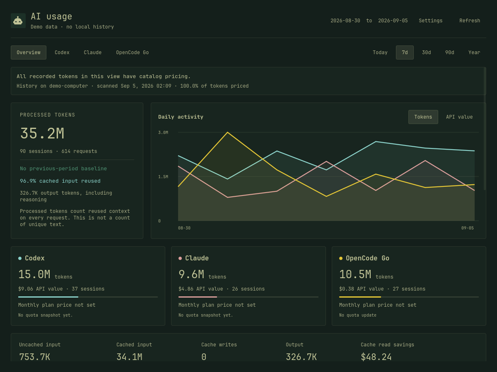

# AI Usage Dashboard for Omarchy

Token trends, account comparisons, usage limits, and estimated API value for AI coding agents. Includes a bar widget that opens the full dashboard.



*Screenshot uses demo data.*

## Install

Requires Omarchy 4 with Quickshell, Python 3.11+, and a systemd user session. Older Waybar-based versions are not supported.

```sh
curl -fsSL https://raw.githubusercontent.com/btsouth/omarchy-usage-dashboard/main/install.sh | bash -s -- --with-plugin
```

Drop `--with-plugin` for the dashboard without the bar widget. Pin a release with `OMARCHY_USAGE_REF=v1.1.0` in front of the command. Installing from a checkout also works:

```sh
git clone https://github.com/btsouth/omarchy-usage-dashboard.git
cd omarchy-usage-dashboard
python3 install.py --with-plugin
```

Open the new bar widget and click **Open analytics**, or search for **AI Usage Dashboard** in your application menu. Both open the same dashboard.

### Using it instead of the built-in widget

The installer adds **AI Usage Dashboard** alongside Omarchy's built-in **Agents** widget. It does not automatically replace it.

For a single AI icon, remove the old Agents widget from your bar layout after installing. Keep the new AI Usage Dashboard widget. Omarchy's packaged files are unchanged, and you can add the original widget back later.

If the new widget does not appear, run:

```sh
omarchy-shell shell rescanPlugins
```

The icon appears once recorded usage is available. You can open the dashboard from the application menu at any time. Large histories may take longer on the first scan.

### Dashboard without a bar widget

Use `python3 install.py` without `--with-plugin`. Open it from the application menu or run:

```sh
~/.local/bin/omarchy-usage-dashboard
```

Both install options run without sudo and keep working if you move or delete the checkout. See [installation details](docs/installation.md) for file locations.

## Features

- Today, 7-day, 30-day, 90-day, and yearly trends, with hourly detail.
- Input, output, and cache totals, estimated API value, and provider comparisons.
- Breakdowns by model, project, client, model provider, account, and session.
- Named accounts with multiple history folders and deduplication of copied records.
- Synced machine ledgers: one shared folder, with each machine importing the others so all stats appear in one dashboard.
- Available usage limits, optional monthly plan comparisons, and Omarchy theme colors.

## Supported sources

| Source | Token history | Usage limits |
| --- | --- | --- |
| Codex | CLI and Codex desktop, including archives | From Omarchy |
| Claude Code | Project transcripts | From Omarchy |
| Grok Build | Completed turns and model calls | From the existing Grok login |
| Gemini CLI | Sessions and subagents | When an Omarchy snapshot is available |
| OpenCode Go | Requests through `opencode-go` | From the existing OpenCode connection |
| OpenCode | Other model providers used through OpenCode | Not collected |
| Pi / Oh My Pi | Saved assistant usage | Not collected |
| Muse | Completed model responses, including subagents | From the existing Muse login |

Sources with recorded history appear automatically on a fresh install. Use **Settings** to choose which ones to show. OpenCode Go uses your existing API key; no cookie setup is needed. If Grok authentication expires, run `grok login`.

Normal ChatGPT, Grok web, and Gemini web conversations are not included. Cursor, Copilot, Windsurf, and Antigravity are not supported. See [provider coverage](docs/provider-coverage.md) for formats and validation limits.

## Multiple accounts

Under **Settings → History accounts**, add a name and one or more agent home folders, such as `/mnt/work/.codex` and `/mnt/work/.claude`. Filter by account or use the Accounts breakdown to compare them.

Folders must already be available locally or mounted. The dashboard does not sync files. Copied records count once; conflicting account assignments are flagged.

Account labels group history, not credentials. **All accounts** shows the current login's quota on this PC, and a labelled account whose usage record carries the same id or name shows its own limits beside it. The overview gives each labelled account its own card, and the daily and hourly charts draw one series per account in its own shade of the provider color, solid for the largest and dashed for the others. Optional monthly prices apply to the local history group when set on a provider, or to one account when set on its label; imported history never inherits the local price. See [account setup](docs/accounts.md).

## Understanding the numbers

- **Processed tokens** count reused context on every request. They are not a count of unique text.
- **API value** uses recorded estimates or catalog prices. OpenCode Go follows the documented model rates, including peak-hour doubling for DeepSeek and the per-model monthly allowances shown on the Go card. It is not your subscription bill. Missing prices stay marked as unpriced.
- **Per-session averages** cover recorded activity in the selected period. A session is not a completed task or a model-efficiency benchmark.

History refreshes every 15 minutes, along with OpenCode Go and enabled Grok quota. **Refresh** also requests fresh Codex and Claude limits from Omarchy. See [pricing details](docs/pricing.md) for rates and accounting.

Metrics stay on your machine. The ledger stores counters, model names, project paths, session IDs, and timestamps. It does not copy conversation bodies or credentials. There is no telemetry.

## Update

Re-run the install command to update:

```sh
curl -fsSL https://raw.githubusercontent.com/btsouth/omarchy-usage-dashboard/main/install.sh | bash -s -- --with-plugin
```

From a checkout, use `git pull --ff-only` and `python3 install.py --with-plugin` instead. Omit `--with-plugin` if you installed without the bar widget. Updates preserve your history and preferences and stop before overwriting installed files you have edited.

## Uninstall

Quit the dashboard with **Ctrl+Q**, then run from the checkout or the archive:

```sh
python3 install.py --uninstall
```

This removes the managed installation and stops its timer. Your usage history and preferences remain. If you removed the built-in Agents widget from your bar, add it back through your bar layout settings.

## Demo and development

Run `python3 demo.py` for generated data without reading your history or credentials. Press Ctrl+C to close it.

See [Contributing](CONTRIBUTING.md) for tests and UI checks.

## Credits

Independent community project. The bar widget is adapted from Omarchy's Agents plugin. The pricing snapshot comes from LiteLLM.

[MIT license](LICENSE) · [Third-party notices](THIRD_PARTY_NOTICES.md)
